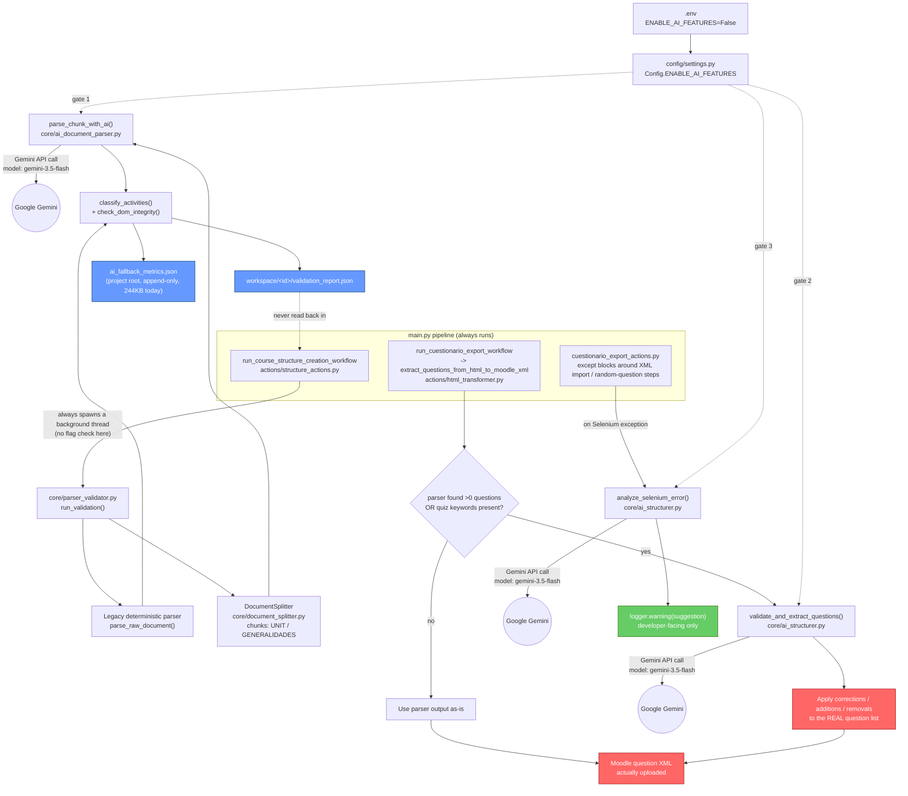
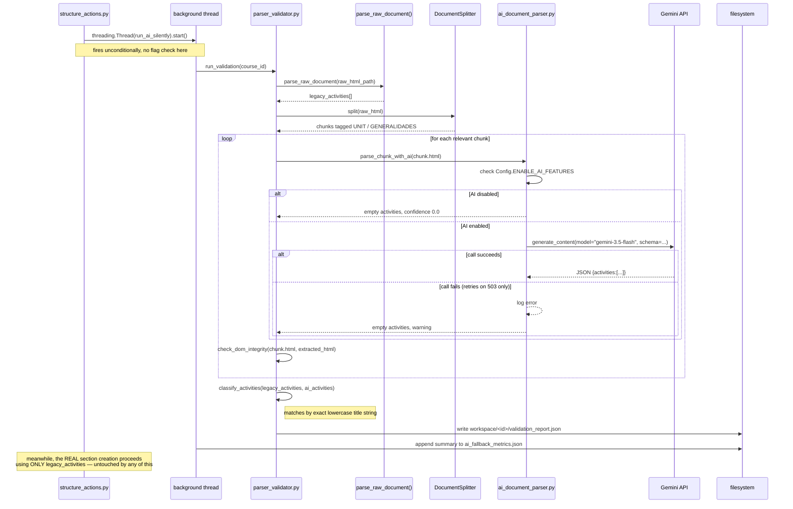
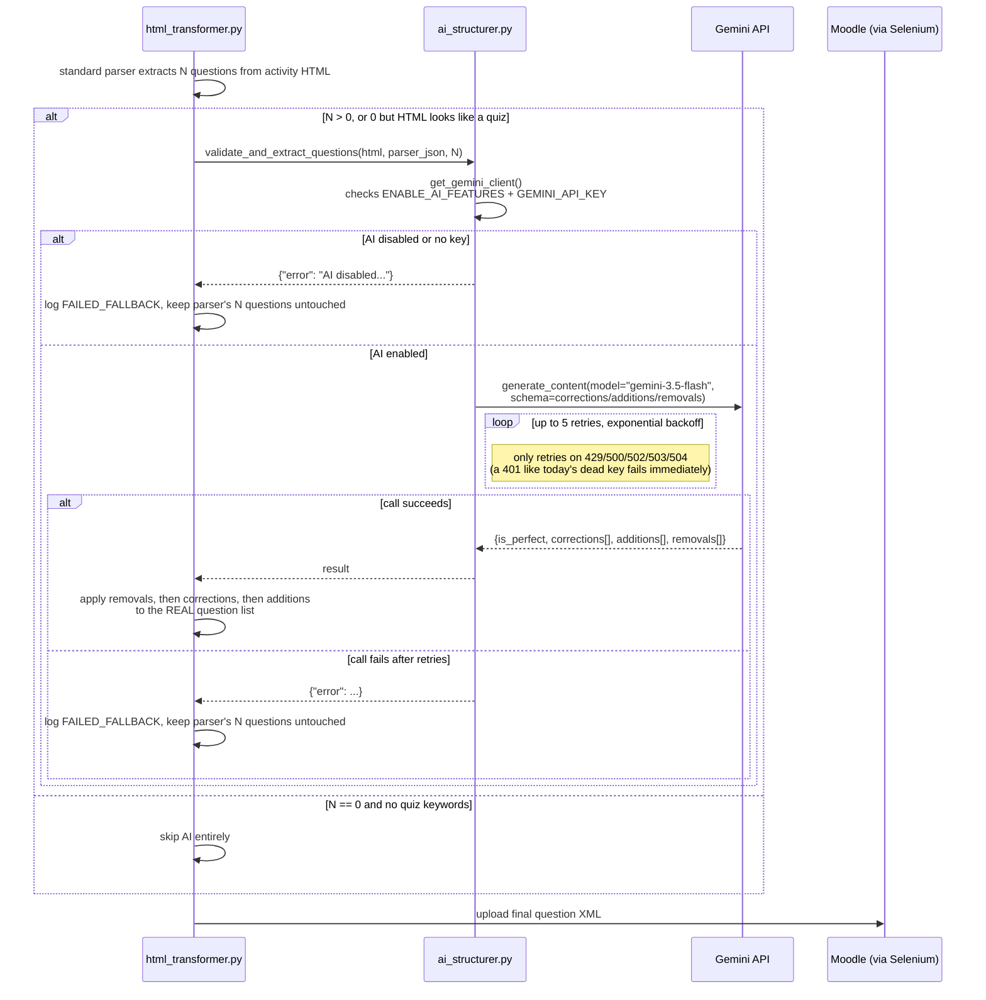

# AI Implementation Review

**Status as found:** `ENABLE_AI_FEATURES=False` in `.env` — confirmed off, matching your recollection.

**Bottom line up front:** even if you flip it back on right now, it will not work. The configured `GEMINI_API_KEY` is dead at the Google Cloud level (confirmed with a live API call, see [Validation Findings](#validation-findings)). (An earlier version of this review also claimed the hardcoded model name wasn't a real Gemini model — that was wrong; see the correction in 3.2.) This is not one AI feature — it's **three independent, unrelated integrations** sharing one on/off switch, with very different levels of risk if something goes wrong.

---

## 1. The three AI integrations

### 1.1 Shadow document-structure validator — read-only, never touches the real upload

Runs automatically inside `run_course_structure_creation_workflow` (the "Estructura en Moodle" step, which is on by default) every time a course structure is created. It spawns a background thread that re-parses the document a second time using an LLM, purely to compare against the real, deterministic parser — the actual course structure that gets built in Moodle only ever comes from the deterministic parser (`parse_raw_document`). The AI's opinion is written to a report file and never fed back in.

**Files:** [core/parser_validator.py](../core/parser_validator.py), [core/ai_document_parser.py](../core/ai_document_parser.py), [core/document_splitter.py](../core/document_splitter.py), triggered from [actions/structure_actions.py:364-407](../actions/structure_actions.py#L364-L407).

**Output:** `workspace/<course_id>/validation_report.json` (per run) and an append-only `ai_fallback_metrics.json` at the project root — this file already has **244KB of real historical data**, proof this ran for real at some point in the past.

### 1.2 Quiz/Cuestionario question QA + auto-correction — DOES affect the real upload

This is the one that matters most. When exporting quiz questions to Moodle XML, if the standard parser found at least one question (or found zero but the HTML looks like it should contain a quiz), the full HTML plus the parser's own extracted questions get sent to Gemini, asking it to validate and fix them. If it succeeds, its `corrections`/`additions`/`removals` are **applied for real** to the question list that gets uploaded — this is the only one of the three where a bad AI response could directly corrupt real course content.

**Files:** [core/ai_structurer.py](../core/ai_structurer.py) (`validate_and_extract_questions`), called from [actions/html_transformer.py:442-541](../actions/html_transformer.py#L442-L541).

### 1.3 Selenium error-diagnosis assistant — pure logging, zero effect on control flow

When a Selenium step fails inside the quiz export workflow, the traceback + current URL get sent to Gemini asking for a plain-English "here's what's probably wrong with the code" suggestion, which is just logged as a warning for a developer to read later. It can never change what the automation does.

**Files:** [core/ai_structurer.py](../core/ai_structurer.py) (`analyze_selenium_error`), called from [actions/cuestionario_export_actions.py:126-128,320-322](../actions/cuestionario_export_actions.py#L126-L128).

### The master switch

`Config.ENABLE_AI_FEATURES` (in `config/settings.py`) is the only kill switch, and it's the **one flag in the whole project that correctly defaults to `False`** (everything else defaults `True` — see the earlier settings-panel fix). It's checked in two different ways depending on the integration:

- `ai_structurer.py`'s `get_gemini_client()` checks it first, then checks `GEMINI_API_KEY` exists, returning `None` cleanly either way — both `validate_and_extract_questions` and `analyze_selenium_error` go through this one gate.
- `ai_document_parser.py`'s `parse_chunk_with_ai` has its **own separate**, duplicated flag check, then constructs a Gemini client with **no explicit key handling at all** — a real inconsistency (see finding below).

---

## 2. Diagrams

### 2.1 Overall architecture



Red = can change what actually gets uploaded to Moodle. Blue = shadow/read-only output, never consumed by the real pipeline. Green = pure logging.

### 2.2 Shadow validator — detailed sequence



### 2.3 Quiz QA / auto-correction — detailed sequence (the one that matters)



---

## 3. Validation Findings

### 3.1 Confirmed: the configured API key is dead — right now, AI cannot work at all

I called the real Gemini API directly with the exact key from `.env`:

```
API key present: True (53 chars)
ERROR: 401 UNAUTHENTICATED
"The bound service account is deleted or disabled.
 The service account bound to the API key must be active."
```

This is independent of `ENABLE_AI_FEATURES`. Flipping that flag to `True` today would make all three integrations attempt real calls and fail every single time, immediately (401 isn't in either retry loop's transient-error list, so this fails fast rather than retrying — that part is handled correctly). You'd need a fresh, active `GEMINI_API_KEY` before any of this could function again.

### 3.2 Corrected (2026-09-25): the model name IS real — but it's pinned by accident, not on purpose

The original version of this finding claimed `gemini-3.5-flash` "has never been a released Gemini model" and was likely a hallucinated placeholder. **That was wrong.** Checked against Google's [models](https://ai.google.dev/gemini-api/docs/models) and [deprecations](https://ai.google.dev/gemini-api/docs/deprecations) pages: `gemini-3.5-flash` is a **Stable** model, released 2026-05-19, with no shutdown date announced. The code introduced it on 2026-07-12 (`git log -S`), after that release, so it was a valid id when written. The claim came from stale knowledge of the model lineup — itself an example of a confident, specific, wrong statement.

What remains true is a softer design point: the model is chosen by a fallback default buried in code (`os.environ.get("GEMINI_MODEL_NAME", "gemini-3.5-flash")` in `core/ai_structurer.py`), with no recorded reason. Newer Flash releases exist (3.6, 3.7, 3.8), and older ones do get shut down (`gemini-2.0-flash` was shut down 2026-06-01), so:
- Set `GEMINI_MODEL_NAME` explicitly in `.env` to a **stable** id (not a `-latest` alias or `-preview`), and note why/when it was chosen.
- Confirm the id with the live model-list endpoint using the new key, rather than from memory.
- Treat any model change as a behavior change: re-run a regression set before switching.

### 3.3 It did work at some point, historically

`ai_fallback_metrics.json` (project root, 244KB) has real entries, e.g. course 70801: legacy parser found 15 activities, AI found 13. So at some point in the past, with presumably-different, valid credentials, this was genuinely running and producing real comparisons. Whatever broke it (key rotated/deleted, or the model name changed) happened after that.

### 3.4 Design weakness: inconsistent client construction — FIXED

> **Update (2026-09-25):** fixed. `parse_chunk_with_ai` now goes through the shared `get_gemini_client()` gate (feature flag, spending cap from `core/ai_budget_guard.py`, and API-key check), so the bare `genai.Client()` described below no longer exists. Kept for history.

`ai_structurer.py::get_gemini_client()` cleanly checks the flag, checks the key exists, and returns `None` if either is missing — every caller handles `None`/`{"error": ...}` gracefully.

`ai_document_parser.py::parse_chunk_with_ai` duplicates the flag check but then does `client = genai.Client()` with **no key argument and no None-check**, outside the retry loop's `try`. I tested this directly: with no API key in the environment at all, `genai.Client()` raises a `ValueError` immediately. In today's setup this particular crash doesn't happen (a key is present, just dead, so the failure happens later inside the retry loop's `try` and is handled). But it's a latent crash risk: if `ENABLE_AI_FEATURES=True` and the env var is ever simply *unset* (rather than set-but-dead), this would throw an unhandled `ValueError` — caught one level up only because `structure_actions.py` happens to wrap the whole background thread in its own `try/except Exception`. That safety net is accidental, not designed into `ai_document_parser.py` itself.

### 3.5 Design weakness: the comparison logic is brittle even when the AI call succeeds

`classify_activities()` matches legacy vs. AI activities by exact, case-insensitive **string equality** on their titles (`act["name"].strip().lower()`). The legacy parser and the AI extraction don't necessarily normalize titles identically — a stray space, a smart quote, or slightly different punctuation between the two would misclassify a real match as "present only in legacy" + "present only in AI," inflating the apparent discrepancy count even when both actually found the same activity correctly. This weakens how much you can trust `ai_fallback_metrics.json`'s historical numbers as a "how good is the AI" signal — some of that gap could be pure string-matching noise, not real disagreement.

### 3.6 Design weakness: the shadow validator runs unconditionally, wasting work while "off"

`structure_actions.py` spawns the validation thread on every single course-structure run with no `ENABLE_AI_FEATURES` check at that call site. With AI off, `parse_chunk_with_ai` correctly short-circuits before any network call — so no wasted API cost — but the thread still: re-runs the entire legacy parser a second time redundantly, runs the semantic splitter, and writes a `validation_report.json` plus appends a near-empty entry (`ai_count: 0`) to the ever-growing `ai_fallback_metrics.json`. Harmless, but pointless CPU/disk work for a feature that's supposed to be fully inert.

### 3.7 The one genuinely risky integration, if re-enabled with a working key

> **Update (2026-09-25):** partly addressed. `actions/html_transformer.py` now runs both checks from `core/html_integrity.py` (`check_dom_integrity` for structure and `check_text_integrity` for verbatim text) on AI corrections/additions before they're applied. Still open: the shadow validator (`core/parser_validator.py`) runs only `check_dom_integrity`, not the text check.

Of the three, **1.2 (quiz QA/auto-correction)** is the only one where a bad AI response directly changes real uploaded content — its `corrections`/`additions`/`removals` overwrite the deterministic parser's question list before upload. The prompt does instruct the model to preserve exact HTML and not invent content, and the JSON schema constrains the shape of the response, but there's no automated integrity check afterward (unlike 1.1, which does run `check_dom_integrity` on the AI's output) — a subtly wrong "correction" would go straight to Moodle with no safety net.

---

## 4. Summary

| # | Integration | Affects real upload? | Currently functional? |
|---|---|---|---|
| 1.1 | Shadow structure validator | No — logged only | No (dead key) |
| 1.2 | Quiz QA / auto-correction | **Yes** | No (dead key) |
| 1.3 | Selenium error diagnosis | No — logged only | No (dead key) |

**To actually re-enable this**, in order:
1. Get a fresh, active `GEMINI_API_KEY` (the current one's backing service account is gone).
2. Pin the model deliberately: set `GEMINI_MODEL_NAME` in `.env` to a stable id confirmed against the live model list (`gemini-3.5-flash` is valid; see 3.2).
3. Only then flip `ENABLE_AI_FEATURES=True` and watch `ai_fallback_metrics.json` grow again to judge quality — keeping in mind finding 3.5 (title-matching noise) when reading those numbers.
