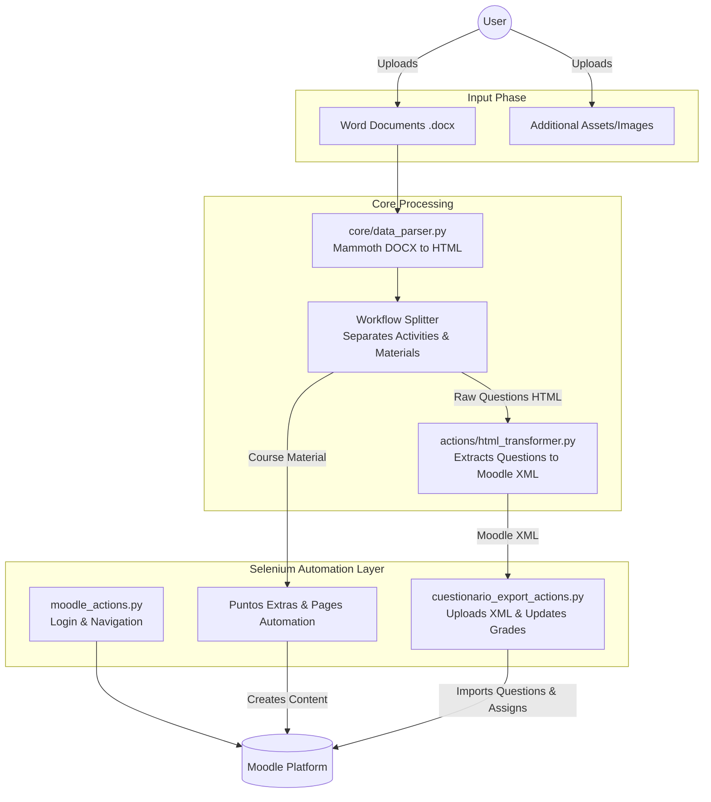
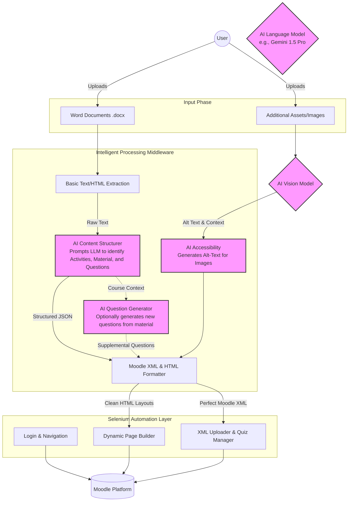

# Project Architecture & Workflow

This document visualizes the current automation workflow for the LA SALLE project and proposes an enhanced architecture integrating AI tools.

## Current Workflow

The current system relies on deterministic scripting (DOM traversal, Regex, and Mammoth) to parse DOCX files and Selenium to automate the Moodle UI.

---

## Recommended AI-Enhanced Workflow

The proposed architecture integrates Large Language Models (LLMs) and computer vision to eliminate brittle regex/DOM parsing. AI acts as an intelligent middleware, transforming unstructured pedagogical documents into perfectly structured Moodle assets, while adding capabilities like automatic question generation and accessibility enhancements.

### Key AI Benefits:
1. **Robust Parsing (`AI Content Structurer`)**: Instead of relying on specific words like "Pregunta 1" or "Respuesta correcta", the LLM reads the document semantically. It can identify a question, its options, and the correct answer regardless of the author's formatting style.
2. **Accessibility (`AI Accessibility`)**: Vision models can automatically describe uploaded images and inject `alt` attributes into the HTML, fulfilling accessibility standards automatically.
3. **Generative Features (`AI Question Generator`)**: The system could read the "Material de Referencia" and automatically propose new quiz questions to the instructor.
